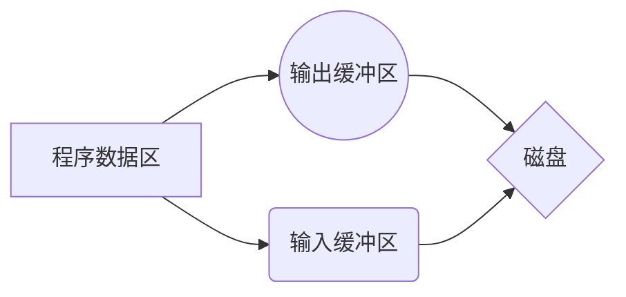

>作者的码云地址：https://gitee.com/dongtiao-xiewei
>后续作者会更新力扣的每日一题系列，原代码会全部上传码云，推荐关注哦，笔芯~

>还像更深入地了解c语言？快来订阅作者的c语言进阶专栏！作者承诺本系列不会TJ！预计更新：指针，字符串处理，内存管理，结构体，预处理等等


今天我们来介绍一下用C语言实现的文件操作
**注意，本章介绍的文件操作只能操作文本文件，也就是.txt文件!用其它类型的文件操作可能会失效**

@[TOC](目录)


# 为什么要有文件
我们在程序中录入数据，**比如一个图书管理系统**当程序退出的时候，如果我们没有任何的保存措施，**那你辛辛苦苦录入的数据就全部消失了！**所以，为了让我们的努力不白费，我们可能需要文件来**永久保存我们在程序中录入的数据**，也就引入了==文件操作==


一个小小的文本文件，帮你永久保存数据
# 文件的简介

这是度娘给的定义，==重点部分已经标出==

>计算机文件属于文件的一种，与普通文件载体不同，计算机文件是以==计算机硬盘为载体==存储在计算机上的==信息集合==。文件可以是文本文档、图片、程序等等。

但是我们在编程中考虑的文件，一般也只有程序文件和数据文件两种

**程序文件**(文件名.后缀名的格式)
1. 源程序文件 *.c
2. 目标文件 *.obj
3. 可执行程序 *.exe

*以上文件将会在预处理章节详细介绍*

**数据文件**

顾明思义，就是存放了各种数据的文件
文件的内容可以不是程序，但一定是程序运行时所必须的数据

**本章内容是围绕数据文件展开的**

# 文件操作理论预备

## 文件流
流在文件操作中，是一个高度抽象的概念

它解决的问题是：数据怎么在内存与外部设备之间流动的

我们知道，现实中，水的流动叫水流，电的流动叫电流

这些流都会从**一个固定的起点到达一个固定的终点**

**文件操作中的文件流也一样，也有固定的流向，我们把它叫做==输入流，输出流==**

我们对应的文件操作，它的流向是**数据->文件->内存**

其中，数据从数据端流向文件，称为**输出，也就是写操作**(write)

数据从文件流向内存，称为**输入，也就是读操作**(read)


## 文件缓冲区

为什么要有文件缓冲区？

**结论：为了能够加快效率**

我们可以类比在现实生活中，**假设有一家只有一个外卖小哥的公司**

而这个外卖小哥却不太聪明的样子，一收到订单就去派送，一收到订单就去派送，结果一次就只能送一家的外卖，有许多家的外卖就理所当然的会被推迟送达时间

为了改进这个方法，我们可以建议，**在订单收到一定数量后，再将这些外卖放在一辆车上，统一派送**

而我们的文件缓冲区也是差不多的道理

**从内存中向磁盘输出数据先送到缓冲区，装满缓冲区后才一起送到磁盘上**

**==这样能提高电脑的运行速度==**



## 文件指针

它是一个被**封装好了的**指针类型，指向被维护文件的起始位置，定义方式为

```c
FILE* pf;//创建文件类型变量
```

**通过文件指针，我们可以找到与它相关联的文件，并进行读写操作**

## 文件类型

1. 文本文件：以ASC码的方式存储数据的文件(*.txt)
2. 二进制文件:直接以二进制存储数据的文件(*.bin)


****
接下来为大家讲讲C语言是如何实现文件操作的
# 文件的操作

## 打开和关闭

**主要是通过两个函数==fopen==和==fclose==实现的**

函数使用方式:

fopen有两个参数，第一个参数是你需要打开文件的文件名：**（注意，需要加上路径！，并且需要以字符串的方式给出文件路径！）**

第二个参数是你想以哪种方式打开文件**（打开方式将在附录给出）**


例如，我们需要打开在D盘，data文件夹下的data.txt文件

我们可以单击右键——>属性查看路径


```c
FILE* pf=NULL;//定义文件指针变量（文件必须要文件指针维护）
pf=fopen("D:\\data\\data.txt","w");//以写入方式打开这个文件
```

我们需要在这里注意一个细节:**'\'字符有转义作用，所以我们需要在\前再加一个\，==防止\把后面的字母转义了！==**

如果文件打开失败，函数将会返回NULL，指针

所以我们要养成一个良好的习惯，打开文件后需要检查打开是否成功！

```c
FILE* pf=NULL;
pf=fopen("D:\\data\\data.txt","w");
if(!pf)
{
	printf("failed!\n");
	exit(-1);
}
else
{
	//文件操作
}
```

而文件关闭函数比较简单，只需传入这个文件的指针即可
**但为了防止==野指针==问题，关闭文件后需要将文件指针==置为空！==**
```c
fclose(pf);
pf=NULL;
```

所以，完整的文件操作流程是

```c
FILE* pf=NULL;
pf=fopen("D:\\data\\data.txt","w");
if(!pf)
{
	printf("failed!\n");
	exit(-1);
}
else
{
	//文件操作
}
fclose(pf);
pf=NULL;
```
## 文件的写（输出）操作

**定义：将数据写入到文件中**(操作函数在附录给出)

**我们需要以'w'(write)方式打开文件**

例如，我们需要在文件中写入一个字符串"helloworld"和一个整数100
fprintf函数介绍：
**第一个参数是要操作的文件指针，其它参数跟printf基本相同**

```c
int main()
{
	FILE* pf = fopen("D:\\data\\data.txt", "w");
	
	if (!pf)
	{
		printf("fail\n");
		exit(-1);
	}
	else
	{
		char* str = "hello world!\n";
		int n = 100;
		fprintf(pf, "%s\n", str);
		fprintf(pf, "%d\n", n);
	}

	fclose(pf);
	pf = NULL;
	return 0;
}
```

程序这儿没有任何提示，就表示我们输出成功了


打开我们的文件，发现已经写入的以下数据


## 文件的读（输入）操作

**定义：将数据读到内存变量中**(操作函数在附录给出)

**我们需要以'r'(read)方式打开文件**

例如，我们需要将文件中的一个字符串"helloworld"和一个整数100
读入到内存变量中
fscanf函数介绍：
**第一个参数是要操作的文件指针，其它参数跟scanf基本相同**


```c
int main()
{
	FILE* pf = fopen("D:\\data\\data.txt", "r");
	
	if (!pf)
	{
		printf("fail\n");
		exit(-1);
	}
	else
	{
		char str[20] = { 0 };
		int n = 0;
		fscanf(pf, "%s", str);
		fscanf(pf, "%d", &n);
		printf("%s\n", str);
		printf("%d\n", n);
	}

	fclose(pf);
	pf = NULL;
	return 0;
}
```

输出结果


****
前面我们讲到的都是顺序读写方式
## 文件随机读写

随机读写可以实现在文件的任何一个位置进行读/写操作

这里主要利用fseek函数

**第一个参数是文件指针，指向要操作的文件**
**第二个参数是偏移量**
**第三个参数是相对于偏移量的起始位置**

例如对ABCDEF进行操作

要读取C字符

这个函数还有三个定义好的常量

1. SEEK_CUR文件此时的位置
2. SEEK_SET文件起始位置
3. SEEK_END文件结束位置

```c
int main()
{
	FILE* pf = fopen("D:\\data\\data.txt", "r");
	
	if (!pf)
	{
		printf("fail\n");
		exit(-1);
	}
	else
	{
		fseek(pf, 2, SEEK_SET);
		char ch = fgetc(pf);
		printf("%c\n", ch);
	}

	fclose(pf);
	pf = NULL;
	return 0;
}
```
也可以再通过c读取a

```c
int main()
{
	FILE* pf = fopen("D:\\data\\data.txt", "r");
	
	if (!pf)
	{
		printf("fail\n");
		exit(-1);
	}
	else
	{
		fseek(pf, 2, SEEK_SET);
		char ch = fgetc(pf);
		printf("%c\n", ch);
		fseek(pf, -2, SEEK_CUR);
		ch = fgetc(pf);
		printf("%c\n", ch);
	}

	fclose(pf);
	pf = NULL;
	return 0;
}
```

## 文件结束判断

**用feof判定**

但文件结束有两个情况，一是文件读取失败，二是文件结束

所以在使用这个函数时，需要判断返回值

EOF则表示文件末尾
但NULL则表示文件读取失败


# 附录

## 文件打开方式

| 字符    | 功能                 |
| ------- | -------------------- |
| **“w”** | 为了输入数据打开文件 |
| **“r”** | 为了输出数据打开文件 |
| “a”     | 向文件末尾添加数据   |
| “rb”    | 输入二进制文件       |
| “wb”    | 输入二进制文件       |
| “wb”    | 追加二进制文件       |
| “r+”    | 为了读写，打开文件   |
| “w+”    | 为了读写，建立文件   |

## 输入输出操作函数
| 功能           | 函数名  |
| -------------- | ------- |
| 字符输入函数   | fgetc   |
| 字符输出函数   | fputc   |
| 文本行输入函数 | fgets   |
| 文本行输出函数 | fputs   |
| 格式化输入函数 | fscanf  |
| 格式化输出函数 | fprintf |
| 二进制输入     | fread   |
| 二进制输出     | fwrite  |